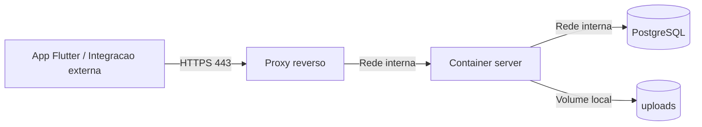
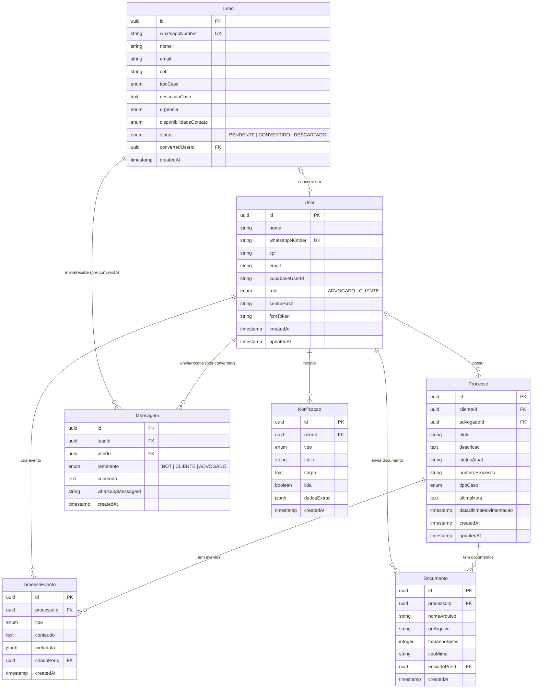
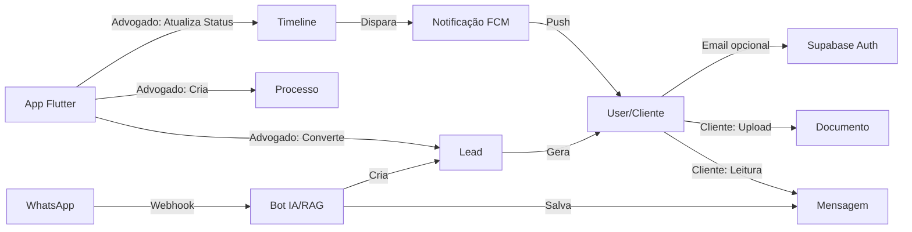

# Arquitetura OmniConnect

## 1. Visão Geral

O OmniConnect segue uma arquitetura **monorepo** com três camadas principais:

```
omniconnect-aurora-g5/
├── mobile/          # App Flutter Único (Perfis Cliente e Advogado)
├── server/          # API Node.js + TypeScript (sem ORM)
└── documentation/   # PRD, specs, decisões, arquitetura
```

---

## 2. Backend — Arquitetura em Camadas

### 2.1 Estrutura de Pastas (Diretório: `server/src/`)

```
server/src/
├── config/                     # Configurações globais e Swagger
├── controllers/implementations/ # Lógica de endpoint e ownership
├── middlewares/implementations/ # Auth, RBAC, Validação, ErrorHandler
├── repositories/               # Camada de Acesso a Dados
│   ├── implementations/        # Implementação em SQL Nativo
│   └── interfaces/             # Contratos dos repositórios
├── routes/v1/                  # Definição de rotas e JSDoc Swagger
├── services/                   # Camada de Regras de Negócio
│   ├── implementations/        # Orquestração e lógica de domínio
│   └── interfaces/             # Contratos dos serviços
├── types/                      # Tipagem centralizada (English)
│   ├── models/                 # Modelos de domínio (Entities)
│   ├── dtos/schemas/           # Zod Schemas p/ validação e OpenAPI
│   └── enums/                  # Enums globais
└── utils/                      # Helpers de Storage e Erros
```

### 2.2 Decisões Técnicas

| Decisão | Opção Escolhida | Justificativa |
|---|---|---|
| Banco de dados | PostgreSQL | Suporte nativo a JSON, PGVector para RAG |
| ORM | **Nenhum** (driver `pg` nativo) | Controle total, performance, [ADR-0003](decisions/0003-data-access-pattern-native-pg.md) |
| Linguagem | TypeScript (strict) | Tipagem forte sem ORM exige interfaces sólidas |
| Arquitetura | Camadas (Controller → Service → Repository) | Separação clara de responsabilidades |
| Proteção Bot | API Key | Garante que apenas o robô de WhatsApp acesse endpoints de ingestão |
| Segurança | Ownership/Tutor | Proteção contra IDOR e acesso não autorizado ([ADR-0004](decisions/0004-fine-grained-security-and-tutor-ownership.md)) |
| Auth complementar | Supabase Auth | Email/senha, confirmacao de email e convites sem transformar lead bruto em conta autenticada (`../.agents/decisions/0007-supabase-auth-complementar.md`) |
| Hospedagem MVP | VM unica com Docker e proxy HTTPS | Menor distancia entre o ambiente atual e o primeiro deploy publico (`../.agents/decisions/0006-hospedagem-mvp-publico.md`) |

### 2.5 Middlewares Globais

A aplicação utiliza um pipeline de middlewares para garantir segurança e consistência:

1. **`errorHandler`**: Captura todas as exceções e as formata conforme os DTOs de erro, ocultando detalhes em produção.
2. **`authMiddleware`**: Valida o token JWT emitido pelo backend e popula o objeto `req.user`. O Supabase Auth pode ser usado antes desse ponto para validar email/senha e vincular `supabase_user_id`, mas as rotas de produto continuam usando o JWT interno.
3. **`roleMiddleware`**: Bloqueia rotas específicas baseadas no papel (`LAWYER` / `CLIENT`).
4. **`apiKeyMiddleware`**: Valida a chave estática para integrações de backend-to-backend.
5. **`validationMiddleware`**: (Zod/Joi) Integração para validar o corpo e parâmetros das requisições.

### 2.6 Padrão de Controllers

Os controladores são implementados como classes, utilizando `RequestHandler` para garantir tipagem:

- **Responsabilidade**: Extrair dados da Request, validar permissões de propriedade (**Ownership**) e invocar o Service correspondente.
- **Injeção**: Repositórios são instanciados no construtor para permitir buscas rápidas de validação de acesso antes da chamada ao serviço.
- **Resposta**: Sempre utilizam códigos HTTP semânticos (200, 201, 204, 401, 403, 404).

### 2.7 Documentação da API (Swagger/OpenAPI)

A API é 100% documentada utilizando o padrão **OpenAPI 3.0** via `swagger-jsdoc`.

- **Acesso**: Disponível na rota `/api-docs` em ambiente de desenvolvimento.
- **Integração com Zod**: Os esquemas de validação Zod (`src/types/dtos/schemas/`) são utilizados para gerar automaticamente as definições de `requestBody`.
- **Modelos de Resposta**: As interfaces de domínio (`src/types/models/`) são mapeadas como componentes Swagger, garantindo agilidade no desenvolvimento do frontend Flutter.
- **Segurança**: A documentação inclui suporte nativo para testes com `bearerAuth` (JWT) e `apiKeyAuth` (Bot Integration).

### 2.8 Deploy Público do MVP

Para o primeiro deploy publico, a arquitetura aprovada usa uma unica VM/VPS Linux com proxy HTTPS na borda. Essa decisao privilegia simplicidade operacional e compatibilidade com o estado atual do backend, que ainda depende de volume local para documentos.

- O trafego publico entra apenas por `443` no proxy reverso.
- O `server` responde internamente na mesma VM e nao deve ser exposto diretamente na internet.
- O PostgreSQL permanece na mesma VM, acessivel apenas pela rede interna.
- O endpoint `/health` e um liveness check simples para operacao e smoke tests.
- O Swagger fica desabilitado quando `NODE_ENV=production`.



### 2.3 Diagrama de Entidades (ER)



### 2.4 Fluxo de Dados Principal



---

## 3. Frontend Flutter — Arquitetura Vertical Slicing

> O projeto superou a etapa puramente visual. Implementou-se o **Full Vertical Slicing com Clean Architecture** e o gerenciamento de estado via **Riverpod** em aproximação das chamadas API (Ref: [ADR-0005](decisions/0005-arquitetura-frontend-flutter.md)).

### 3.1 Estrutura de Pastas de Alto Nível (Diretório: `mobile/lib/`)
- **`app/`** — Configuração central (tema global, routes, configuração base do system chrome).
- **`features/`** — Hospeda a ramificação principal `client` (App do Cliente) e `lawyer` (App do Advogado), contendo dentro de si o real Vertical Slicing por sub-feature.
- **`shared/`** — Componentes visuais (`widgets/`), utilitários estritos e provedores globais que circulam nos 2 aplicativos simultaneamente sem estarem atrelados a um domínio.

### 3.2 O Padrão Vertical Slicing
Diferente da formatação plana inicial, onde existia uma única pasta `presentation` com dezenas de telas, cada rota e funcionalidade virou uma "sub-feature" isolada (ex: `features/client/home`, `features/lawyer/leads`).

Cada sub-feature abriga os pilares da Clean Architecture:
```
<sub-feature_name>/
├── data/
│   ├── data_sources/    ← Mapeamento HTTP/Supabase (Remote)
│   ├── models/          ← DTOs para parse JSON
│   └── repositories/    ← Ponte conectando API à regra local
├── domain/
│   ├── entities/        ← Regras e modelos 100% livres de dependência nativa
│   ├── repositories/    ← Interfaces obrigatórias do backend
│   └── usecases/        ← Execution flow puro
└── presentation/
    ├── providers/       ← Riverpod Notifiers (Estado reativo da UI conectada aos UseCases)
    ├── screens/         ← UI Scaffolds (Páginas Base)
    └── widgets/         ← Pedaços de UI específicos dessa sub-feature
```

### 3.3 Padronização Visual e Regras de UI
A interface está lapidada sobre as seguintes regras fixas consolidadas:
- **Clean Aesthetic e Espaçamento Restrito:** Reduziu-se o uso de `Dividers` supérfluos, apostando em margens e hierarquia de sombra para divisórias limpas.
- **Headers Brancos Unificados:** As "AppBars" usam `backgroundColor` branco com setas restritas e barra de pesquisa padrão. Não inventamos cores extras.
- **Edge-to-Edge Fluid (No Bleeding):** A `AppBottomNavigationBar` trabalha unida ao `SafeArea` sem provocar retenções na barra de navegação virtual do S.O. O `SystemUiOverlayStyle` também tem comportamentos base para ser 100% transparente.

### 3.4 Gestão de Estado e Backend
Com o **Deploy do MVP Endurecido (ADR-0006)** o ambiente de Nuvem tem zero tolerância a chamadas vulneráveis.
- É regra obrigatória usar as injeções reativas do `Riverpod` em vez de passar variáveis complexas via construtores Stateless.
- A comunicação com o Backend nas datasources exige envio robusto de JWT/Bearer, pois o *Swagger* e CORS estão restritos para Production.

---

## 4. Decisões Adiadas

| Item | Motivo |
|---|---|
| Estratégia de cache/offline | Depende da definição de sincronização real-time |
| Tabela `embeddings_rag` | Será definida no ticket de IA (PGVector) |
| WebSocket para tempo real | Será avaliado junto com a latência de 2s do PRD |

---

## 5. Referências

- [ADRs (Architectural Decision Records)](documentation/decisions/)
- [Guia de Transição: Local para S3](documentation/specs/storage_aws_transition.md)
- [Sistema de Segurança](documentation/specs/security_system.md)
