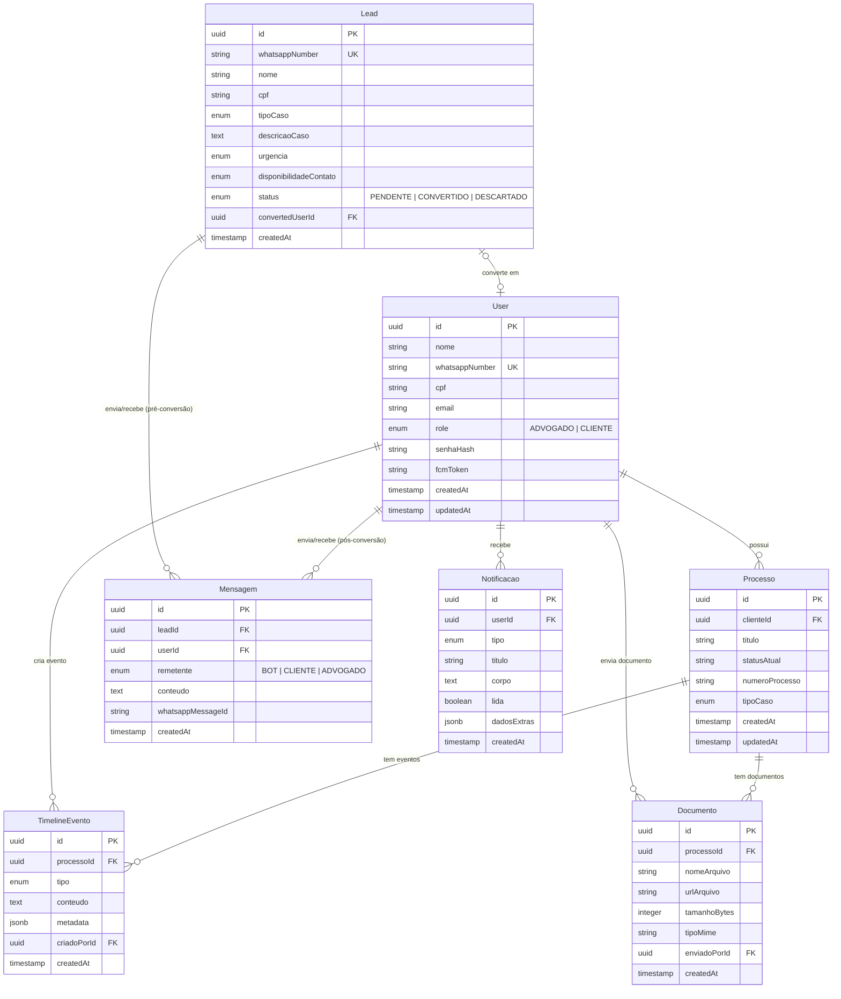
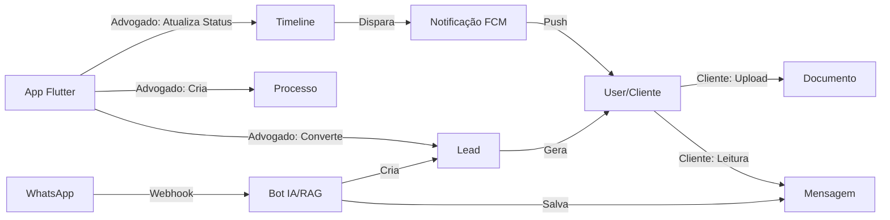

# Arquitetura OmniConnect

## 1. Visão Geral

O OmniConnect segue uma arquitetura **monorepo** com três camadas principais:

```
omniconnect-aurora-g5/
├── mobile/          # App Flutter Único (Perfis Cliente e Advogado)
├── server/          # API Node.js + TypeScript (sem ORM)
└── documentation/   # PRD, specs, decisões, arquitetura
```

---

## 2. Backend — Arquitetura em Camadas

### 2.1 Estrutura de Pastas

```
server/src/
├── models/                    # Entidades do domínio (interfaces TS)
│   └── dtos/                  # Data Transfer Objects
├── repositories/interfaces/   # Contratos de acesso a dados
├── services/interfaces/       # Contratos de regras de negócio
├── controllers/               # Endpoints HTTP (futuro)
├── config/                    # Configuração do app (futuro)
├── middlewares/               # Auth, validação, etc (futuro)
└── utils/                     # Helpers compartilhados (futuro)
```

### 2.2 Decisões Técnicas

| Decisão | Opção Escolhida | Justificativa |
|---|---|---|
| Banco de dados | PostgreSQL | Suporte nativo a JSON, PGVector para RAG |
| ORM | **Nenhum** (driver `pg` nativo) | Controle total, performance, ADR-0003 |
| Linguagem | TypeScript (strict) | Tipagem forte sem ORM exige interfaces sólidas |
| Arquitetura | Camadas (Controller → Service → Repository) | Separação clara de responsabilidades |

### 2.3 Diagrama de Entidades (ER)



### 2.4 Fluxo de Dados Principal



---

## 3. Frontend Flutter — Arquitetura por Features

> Documentado na task G5-5. Estrutura baseada em features com navegação centralizada.

Diretório: `mobile/lib/`
- `app/` — configuração central (tema, rotas, shell)
- `features/` — features isoladas por domínio
- `shared/` — componentes e utilitários reutilizáveis

---

## 4. Decisões Adiadas

| Item | Motivo |
|---|---|
| Estratégia de cache/offline | Depende da definição de sincronização real-time |
| Tabela `embeddings_rag` | Será definida no ticket de IA (PGVector) |
| Autenticação JWT completa | Placeholders existem; implementação no ticket de API |
| WebSocket para tempo real | Será avaliado junto com a latência de 2s do PRD |