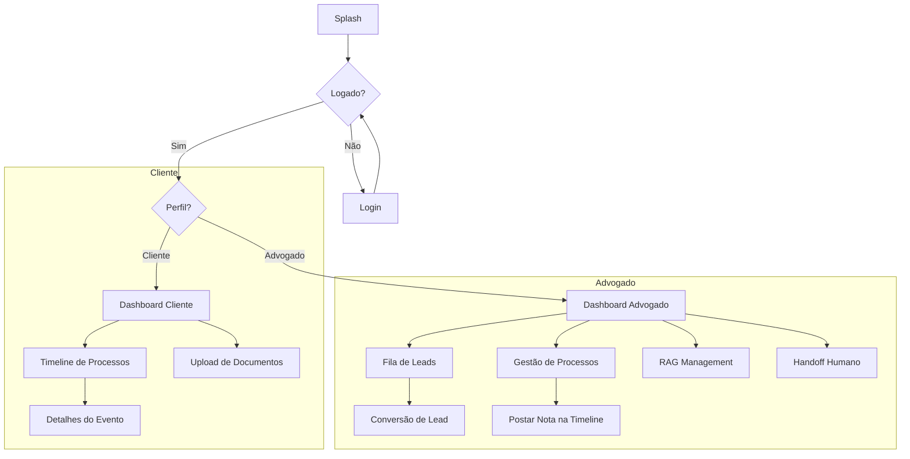

# Guia de Design e Especificação Visual - OmniConnect (App Único)

Este documento serve como a **Fonte da Verdade** para o design do aplicativo OmniConnect, orientando a criação de wireframes no Pencil/Figma e a implementação final em Flutter.

---

## 🎨 Identidade Visual e Estilo

### 1. Paleta de Cores (Acessibilidade WCAG AA)
Foco em alto contraste para legibilidade jurídica.

| Cor | Hex | Uso Sugerido | Contraste |
| :--- | :--- | :--- | :--- |
| **Principal (Dark Blue)** | `#1A237E` | Barras de navegação, Botões primários. | Alto |
| **Acento (Gold)** | `#C5A059` | Destaques de status "Urgente", Ícones jurídicos. | Médio |
| **Sucesso (Emerald)** | `#2E7D32` | Processo concluído, Documento aprovado. | Alto |
| **Erro (Crimson)** | `#C62828` | Alertas de prazo, Erros de upload. | Alto |
| **Fundo (Ghost White)** | `#F8F9FA` | Cor de fundo das telas (reduz fadiga visual). | - |

### 2. Tipografia
- **Fonte Primária:** `Inter` ou `Roboto` (Sans-serif moderna).
- **Hierarquia:**
  - `H1`: Bold, 24px (Títulos de Tela)
  - `Body`: Regular, 16px (Conteúdo Geral)
  - `Caption`: Light, 12px (Datas e Metadados)

---

## 📱 Inventário de 16 Telas (Blueprints)

### Perfil: Cliente (6 Telas)

1.  **Splash Screen**
    - **Objetivo:** Branding e carregamento de sessão.
    - **Elementos:** Logotipo centralizado, spinner de carregamento discreto.
2.  **Login/Autenticação**
    - **Objetivo:** Acesso via credenciais geradas pelo advogado.
    - **Elementos:** Campo de Telefone (Máscara), Senha Temporária, Botão "Acessar via WhatsApp".
3.  **Home (Dashboard Cliente)**
    - **Objetivo:** Visão geral da situação jurídica.
    - **Elementos:** Card de Boas-vindas, Contador de Processos Ativos, Botão flutuante para "Dúvida Rápida (Bot)".
4.  **Lista de Processos / Timeline**
    - **Objetivo:** Consultar o status de casos específicos.
    - **Elementos:** Lista com Nome do Processo, Número e "Status Atual" destacado em Badge colorido.
5.  **Detalhes do Processo (Linha do Tempo)**
    - **Objetivo:** Transparência total sobre movimentações.
    - **Elementos:** Feed vertical cronológico com ícones (📅 Audiência, 📄 Petição). Notas curtas do advogado.
6.  **Gestão de Documentos**
    - **Objetivo:** Envio e consulta de arquivos.
    - **Elementos:** Lista de arquivos anexados, Status de Upload, Botão "Enviar Novo Documento (+)".

---

### Perfil: Advogado (10 Telas)

1.  **Dashboard Advogado (Admin)**
    - **Objetivo:** Controle de produtividade do escritório.
    - **Elementos:** Gráfico de Pizza (Cível vs Trabalhista), Contador de "Novos Leads", Alerta de Handoff Humano.
2.  **Fila de Triagem (Leads do Bot)**
    - **Objetivo:** Gerenciar novos contatos vindos do WhatsApp.
    - **Elementos:** Card com Nome, CPF pré-validado e "Tipo de Caso". Tags de Urgência (Alta/Média/Baixa).
3.  **Conversão de Lead / Cadastro**
    - **Objetivo:** Transformar prospecto em cliente ativo.
    - **Elementos:** Formulário com dados capturados, botão "Criar Usuário e Gerar Senha".
4.  **Gestão de Processos (Escritório)**
    - **Objetivo:** Visão global de todos os casos.
    - **Elementos:** Busca por CPF/Nome, Filtro por Advogado Responsável, Ordenação por data de atualização.
5.  **Abertura de Novo Processo**
    - **Objetivo:** Registro manual de novos casos.
    - **Elementos:** Seleção de Cliente (Autocomplete), Título do Caso, Instância Inicial.
6.  **Editor de Timeline (Postar Nota)**
    - **Objetivo:** Informar o cliente sobre movimentações.
    - **Elementos:** Campo de texto (Markdown opcional), Seletor de Tipo de Evento (Audiência, Despacho, etc).
7.  **Diretório de Clientes**
    - **Objetivo:** Acesso rápido aos dados de contato dos clientes.
    - **Elementos:** Lista alfabética, botão de chamada direta/WhatsApp.
8.  **Central de Documentos (Review)**
    - **Objetivo:** Aprovar ou baixar arquivos enviados pelos clientes.
    - **Elementos:** Tabela de arquivos com Preview, botão de Download e Status de "Recebido/Visto".
9.  **Gestão da Base de Conhecimento (IA)**
    - **Objetivo:** Treinar o bot com novos PDFs/Jurisprudências.
    - **Elementos:** Upload de arquivos para RAG, lista de documentos indexados pela IA.
10. **Suporte Humano (Handoff)**
    - **Objetivo:** Assumir conversas críticas do WhatsApp.
    - **Elementos:** Chat em tempo real espelhado com transcrição do que a IA já falou anteriormente.

---

## 🗺️ Fluxo de Navegação (Mermaid)

---

## 🛠️ Componentes e Estados de UI

### Estados Globais
- **Loading:** Utilizar *Skeleton Screens* (cinza pulsante) em vez de Spinners no centro da tela para manter a estrutura visível.
- **Empty State:** Ilustrações minimalistas com texto "Nenhum processo encontrado" e um botão de ação (ex: "Falar com Advogado").
- **Offline:** Banner persistente no topo: ⚠️ "Você está offline. Algumas informações podem estar desatualizadas."

### Componentes Principais
- **Cards:** Bordas arredondadas (8px), sombra suave (depth 1), padding 16px.
- **Botões:** Bordas arredondadas (4px para tom profissional), altura mínima de toque 48px.

---

## ♿ Acessibilidade e Regras de Ouro
1.  **Touch Targets:** Mínimo de 48x48 pixels para todos os elementos interativos.
2.  **Hierarquia de Cabeçalhos:** Uso correto de H1 a H3 para leitores de tela.
3.  **Contraste:** Texto sobre fundo deve manter proporção 4.5:1 (WCAG AA).
4.  **Feedback Visual:** Nunca usar apenas cor para indicar status (Ex: Usar Ícone + Cor).

---
*Gerado automaticamente para a Task G5-11. Versão 1.0*
