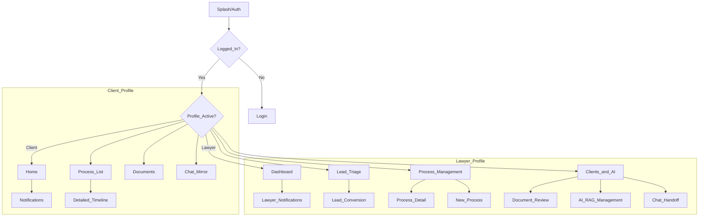

# Guia de Design e Especificação Funcional (App Único)

Este documento é a fonte de verdade para a interface do aplicativo OmniConnect. Ele orienta a equipe de design sobre a estrutura, navegação e requisitos de dados, garantindo consistência entre os perfis de **Cliente** e **Advogado**.

## 🎨 Identidade Visual (Referência)

Foco em profissionalismo jurídico e conformidade **WCAG AA**.

### Paleta de Cores
| Color | Hex | Suggested Use |
| :--- | :--- | :--- |
| **Primary (Blue)** | `#1A237E` | App Bars, Botões Primários, Ícones Ativos. |
| **Secondary (Gold)** | `#C5A059` | Destaques, Badges, Ícones de Processo. |
| **Surface** | `#F8F9FA` | Cor de fundo predominante. |
| **Error** | `#C62828` | Alertas críticos, Prazo Vencido. |
| **Success** | `#2E7D32` | Concluídos, Sucesso. |

### Tipografia
- **Primary Font**: `Inter` (Sans-serif)
- **H1 (Titles)**: Bold, 24px
- **H2 (Subtitles)**: Semi-Bold, 18px
- **Body**: Regular, 16px
- **Caption**: Light, 12px

---

## 🧭 Arquitetura de Navegação

O aplicativo utiliza uma **Bottom Tab Bar** que se adapta dinamicamente ao perfil logado.

### Fluxo de Navegação

---

## 🔄 Lógica de Troca de Perfil

O OmniConnect é um **App Único**. A interface deve refletir a mudança de contexto visualmente:
1.  **Tab Bar**: Os ícones e destinos das abas mudam conforme o perfil.
2.  **Breadcrumbs/Contexto**: Títulos de tela devem deixar claro se o usuário está agindo como "Cliente" ou "Gestor/Advogado".
3.  **Configurações**: Deve existir um atalho claro no Perfil para alternar entre os contextos (se o usuário possuir ambas as permissões).

---

## 🛠️ Estados de UI e Acessibilidade

### Estados Globais
- **Loading**: Utilizar *Skeletons* que espelham a estrutura final do card/lista.
- **Empty State**: Ilustração minimalista + Texto explicativo + Botão de ação (ex: "Nenhum processo encontrado. Vincular agora").
- **Erro**: Mensagem técnica amigável + Botão "Tentar Novamente".

### Acessibilidade (Mínimos)
- **Touch Targets**: Mínimo de `48x48dp` para todos os elementos clicáveis.
- **Contraste**: Seguir WCAG AA (Mínimo 4.5:1 para texto normal).
- **Leitura**: Suporte a redimensionamento de fonte do sistema.

---

## 📁 Screen Inventory (16 Blueprints)

Acesse os links abaixo para o detalhamento de campos e integrações com o backend.

### 👤 Client Profile (6)
1.  [Home/Dashboard](design/screens/client/cl-01-home.md) - Visão 360.
2.  [Process List](design/screens/client/cl-02-process-list.md) - Meus casos.
3.  [Process Timeline](design/screens/client/cl-03-process-timeline.md) - Detalhes do evento.
4.  [Notifications](design/screens/client/cl-04-notifications.md) - Histórico de alertas.
5.  [Documents](design/screens/client/cl-05-documents.md) - Meus arquivos.
6.  [Chat Mirror](design/screens/client/cl-06-chat-mirror.md) - Suporte IA.

### ⚖️ Lawyer Profile (10)
1.  [Dash Admin](design/screens/lawyer/ad-01-dashboard.md) - Métricas da banca.
2.  [Lead Triage](design/screens/lawyer/ad-02-lead-triage.md) - Novos contatos.
3.  [Lead Detail](design/screens/lawyer/ad-03-lead-detail.md) - Qualificação e Conversão.
4.  [Process Management](design/screens/lawyer/ad-04-process-management.md) - Kanban/Lista global.
5.  [Process Panel](design/screens/lawyer/ad-05-process-detail.md) - Ações administrativas.
6.  [New Process](design/screens/lawyer/ad-06-new-process.md) - Formulário de entrada.
7.  [Client Directory](design/screens/lawyer/ad-07-client-directory.md) - CRM Jurídico.
8.  [Document Review](design/screens/lawyer/ad-08-document-review.md) - Validação de arquivos.
9.  [AI Management](design/screens/lawyer/ad-09-ai-rag-management.md) - Configuração do RAG.
10. [Chat Handoff](design/screens/lawyer/ad-10-chat-handoff.md) - Suporte Humano.
