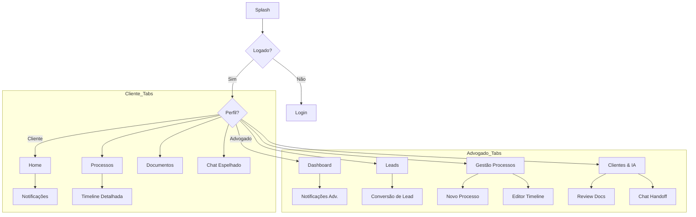

# Arquitetura de Navegação - OmniConnect

Define como o usuário transita entre os perfis e acessa as 16 telas do app.

## 🧭 Bottom Tab Bar (4 Abas)

A barra inferior é persistente e muda conforme o perfil logado.

### Perfil: Cliente
1.  **Home**: Visão 360 e Atalho Notificações.
2.  **Processos**: Lista de casos ativos.
3.  **Documentos**: Central de arquivos.
4.  **Chat**: Histórico de suporte.

### Perfil: Advogado
1.  **Dash**: Métricas e Alertas.
2.  **Leads**: Triagem de novos contatos.
3.  **Processos**: Gestão global de casos.
4.  **Clientes & IA**: Diretório e RAG.

## 🗺️ Fluxo Visual (Mermaid)

## 📄 Detalhamento por Tela
Acesse a [Pasta de Blueprints](screens/README.md) para ver o mapeamento de campos e lógica de cada uma.
