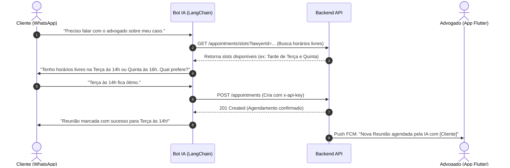

# Especificação Técnica: Sistema de Agenda do Advogado e Controle de Prazos via IA

**Documento:** `g5-21-sistema-agenda-advogado.md`  
**Status:** Planejado / Aprovado  
**Objetivo:** Adicionar gestão de agenda e prazos críticos para o advogado, permitindo que a IA realize marcação de reuniões de forma autônoma com clientes via WhatsApp e que o backend notifique proativamente os prazos iminentes.

---

## 1. Visão Geral e Casos de Uso

A ausência de controle automatizado de prazos e o tempo gasto no alinhamento de agendas são grandes pontos de atrito na rotina jurídica. Esta funcionalidade atua em duas frentes principais:
1. **Lembrete Proativo de Prazos:** O sistema monitora datas críticas e dispara alertas via Push (FCM) antes do vencimento.
2. **Agendamento Autônomo (IA):** O assistente no WhatsApp consulta a disponibilidade do advogado e agenda reuniões com clientes diretamente, sincronizando com o App Flutter em tempo real.

---

## 2. Modelagem de Dados (Backend)

Criar a entidade/tabela de domínio focada no gerenciamento de tempo. Seguindo o padrão do repositório (`server/src/types/models/src/`), a estrutura será:

### 📄 Interface `Appointment` (`appointment.model.ts`)
```typescript
import type { AppointmentType, AppointmentStatus } from '@enums';

export interface Appointment {
  id: string;                     // UUID PK
  lawyerId: string;               // FK para User (Obrigatório, dono da agenda)
  clientId: string | null;        // FK para User (Obrigatório se for reunião com cliente)
  processId: string | null;       // FK para LegalProcess (Obrigatório se for prazo/audiência de processo)
  title: string;                  // Ex: "Audiência de Conciliação", "Reunião de Alinhamento", "Prazo: Contestação"
  description: string | null;     // Pauta da reunião, link da sala virtual ou anotações do prazo
  type: AppointmentType;          // 'MEETING' | 'DEADLINE' | 'HEARING' | 'OTHER'
  scheduledAt: Date;              // Data e hora exata do evento/vencimento
  durationMinutes: number | null; // Duração estimada (para calcular choques de horário)
  status: AppointmentStatus;      // 'SCHEDULED' | 'COMPLETED' | 'CANCELED'
  reminded: boolean;              // Flag de controle interno do worker de notificações
  createdAt: Date;
  updatedAt: Date;
}
```

### 🏷️ Atualização em Enums Globais (`enums.ts`)
Adicionar os tipos literais para suporte à nova entidade:
```typescript
/** Tipos de compromissos na agenda */
export type AppointmentType = 'MEETING' | 'DEADLINE' | 'HEARING' | 'OTHER';

/** Status do compromisso */
export type AppointmentStatus = 'SCHEDULED' | 'COMPLETED' | 'CANCELED';
```
*(Nota: Em `NotificationType` já possuímos tipos adequados ou podemos complementar com `'DEADLINE_WARNING'`, e em `TimelineEventType` já existe o nativo `'EVENT_SCHEDULED'`)*.

---

## 3. Endpoints da API (REST / Zod OpenAPI)

Criar rotas protegidas sob o prefixo `/api/v1/appointments` no padrão Controller → Service → Repository nativo em `pg`:

- **`POST /appointments`**
  - **Atores:** Advogado (via App) ou Robô de IA (via chave `x-api-key`).
  - **Comportamento:** Valida conflitos de horário para o `lawyerId` e persiste o agendamento. Se atrelado a um `processId`, gera automaticamente um evento na timeline (`TimelineEventType.EVENT_SCHEDULED`).
- **`GET /appointments`**
  - **Query Params:** `startDate`, `endDate`, `lawyerId`, `processId`, `type`.
  - **Segurança:** O middleware de ownership garante que o advogado veja apenas sua agenda e o cliente veja apenas eventos onde seu `clientId` está vinculado.
- **`PATCH /appointments/:id`**
  - Permite alterar status (`COMPLETED` / `CANCELED`) ou remarcar data/hora. Dispara notificação de alteração se envolver um cliente.

---

## 4. Orquestração com IA e RAG (LangChain)

Para que o bot do WhatsApp marque reuniões de forma autônoma sem causar sobreposições:



### 🛠️ Nova Tool LangChain: `check_availability_and_schedule`
O agente possuirá uma ferramenta nativa que recebe a intenção de data/hora do usuário, valida o tempo livre na agenda daquele advogado específico e executa a chamada na API de ingestão.

---

## 5. Worker de Lembrete de Prazos (Background Service)

Uma rotina interna (usando `node-cron` ou loop temporizado no servidor Node.js) executará varreduras contínuas:
- **Regra:** Busca registros onde `type IN ('DEADLINE', 'HEARING')`, `status === 'SCHEDULED'`, `reminded === false` e `scheduledAt` esteja a menos de **24 horas** do momento atual.
- **Ação:** Dispara notificação push de alta prioridade para o token FCM do advogado:
  > ⚠️ **Prazo Crítico Vencendo Amanhã:** [Título do Agendamento] atrelado ao processo [Número/Nome].
- **Persistencia:** Marca `reminded = true` no banco para evitar duplicação do envio.

---

## 6. Frontend Flutter (Vertical Slicing)

No aplicativo mobile (`mobile/lib/`), será construída a sub-feature de agenda para a persona do advogado:

```
mobile/lib/features/lawyer/schedule/
├── data/
│   ├── datasources/schedule_remote_datasource.dart
│   └── repositories/schedule_repository_impl.dart
├── domain/
│   └── usecases/get_schedule_usecase.dart
└── presentation/
    ├── providers/schedule_provider.dart       ← Riverpod Notifier (Lista e Filtros)
    ├── screens/lawyer_schedule_screen.dart    ← UI Principal
    └── widgets/
        ├── appointment_card.dart              ← Card com cor de destaque por Tipo
        └── month_calendar_view.dart           ← Visão compacta de calendário
```

### 🎨 Diretrizes Visuais e UX
- **Design Clean:** Uso do fundo branco padrão com o calendário em formato expansível (semana/mês).
- **Indicadores Visuais (Prazos vs Reuniões):**
  - 🔴 **Prazos (`DEADLINE`):** Borda ou tag vermelha de alta urgência para capturar a atenção imediata do advogado.
  - 🔵 **Reuniões (`MEETING`):** Destaque azul suave, exibindo o botão rápido "Abrir WhatsApp do Cliente" ou link da sala virtual.
- **Sincronia Imediata:** Atualização da interface via Riverpod assim que a IA agendar uma nova reunião ou o status for modificado.
